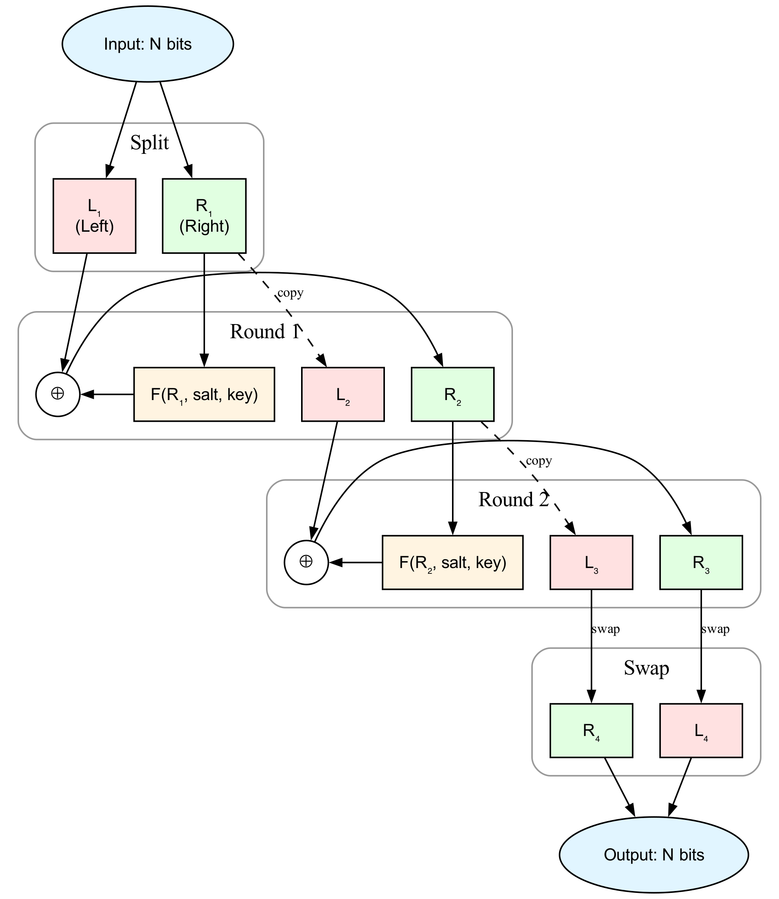

# FeistelCipher

Encrypted integer IDs using Feistel cipher

> **Database Support**: PostgreSQL only (uses PostgreSQL triggers and functions)

## Why?

**Problem**: Sequential IDs (1, 2, 3...) leak business information:
- Competitors can estimate your growth rate
- Users can enumerate resources (`/posts/1`, `/posts/2`...)
- Total record counts are exposed

**Common Solutions & Issues**:
- UUIDs: Fixed 36 chars for everything - overkill for most columns
- Random integers: Collision risks, complex generation logic

**This Library's Approach**:
- Store sequential integers internally
- Expose encrypted integers externally (non-sequential, unpredictable)
- **Adjustable bit size per column**: User ID = 40 bits, Post ID = 52 bits
- Automatic encryption via database trigger

## How It Works

The Feistel cipher is a symmetric structure used in the construction of block ciphers. This library implements a configurable Feistel network that transforms sequential integers into non-sequential encrypted integers with one-to-one mapping.

<p align="center">
  
</p>

> **Note**: The diagram above illustrates a 2-round Feistel cipher for simplicity. By default, this library uses **16 rounds** for better security. The number of rounds is configurable (see [Trigger Options](#trigger-options)).

### Self-Inverse Property

The Feistel cipher is **self-inverse**: applying the same function twice returns the original value. This means encryption and decryption use the exact same algorithm.

**Mathematical Proof:**

Let's denote the input as $(L_1, R_1)$ and the round function as $F(x)$.

**First application (Encryption):**

$$
\begin{aligned}
L_2 &= R_1, & R_2 &= L_1 \oplus F(R_1) \\
L_3 &= R_2, & R_3 &= L_2 \oplus F(R_2) \\
\text{Output} &= (R_3, L_3)
\end{aligned}
$$

**Second application (Decryption) - Starting with $(R_3, L_3)$:**

$$
\begin{aligned}
L_2' &= L_3, & R_2' &= R_3 \oplus F(L_3) \\
&= L_3, & &= R_3 \oplus F(R_2) \\
&= L_3, & &= (L_2 \oplus F(R_2)) \oplus F(R_2) \\
&= L_3, & &= L_2 = R_1 \quad \text{(XOR cancellation)} \\
\\
L_3' &= R_2' = R_1, & R_3' &= L_2' \oplus F(R_2') \\
&= R_1, & &= L_3 \oplus F(R_1) \\
&= R_1, & &= R_2 \oplus F(R_1) \\
&= R_1, & &= (L_1 \oplus F(R_1)) \oplus F(R_1) \\
&= R_1, & &= L_1 \quad \text{(XOR cancellation)} \\
\\
\text{Output} &= (R_3', L_3') = (L_1, R_1) \quad \checkmark
\end{aligned}
$$

**Key Insight:** The XOR operation's property $a \oplus b \oplus b = a$ ensures that each transformation is reversed when applied twice.

**Database Implementation:**

In the database trigger implementation, this means:
```sql
-- Encryption: seq → id
id = feistel_encrypt(seq, bits, key)

-- Decryption: id → seq (using the same function!)
seq = feistel_encrypt(id, bits, key)
```

### Key Properties

- **Deterministic**: Same input always produces same output
- **Non-sequential**: Sequential inputs produce seemingly random outputs
- **Collision-free**: One-to-one mapping within the bit range

## Installation

> **Using Ash Framework?** 
> 
> If you're using [Ash Framework](https://ash-hq.org/), use [`ash_feistel_cipher`](https://github.com/devall-org/ash_feistel_cipher) instead! It provides a declarative DSL to configure Feistel cipher encryption directly in your Ash resources.
>
> For plain Ecto users, continue below.

### Using igniter (Recommended)

```bash
mix igniter.install feistel_cipher
```

### Manual Installation

```elixir
# mix.exs
def deps do
  [{:feistel_cipher, "~> 0.13.3"}]
end
```

Then run:
```bash
mix deps.get
mix feistel_cipher.install
```

### Installation Options

Both methods support the following options:

* `--repo` or `-r`: Specify an Ecto repo (required for manual installation)
* `--functions-prefix` or `-p`: PostgreSQL schema prefix (default: `public`)
* `--functions-salt` or `-s`: Cipher salt constant, max 2^31-1 (default: randomly generated)

> ⚠️ **Security Note**: A cryptographically random salt is generated by default for each project. This ensures that encryption patterns cannot be analyzed across different projects. Never use the same salt across multiple production projects.

> **Fun Fact**: Notice the timestamp `19730501000000` in the migration file generated during installation? That's May 1, 1973 - the day [Horst Feistel published his groundbreaking paper](https://en.wikipedia.org/wiki/Feistel_cipher#History) at IBM, introducing the cipher structure that powers this library. We thought it deserved a permanent timestamp in your database history! 🎂


## Usage Example

### 1. Create Migration

```elixir
defmodule MyApp.Repo.Migrations.CreatePosts do
  use Ecto.Migration

  def up do
    create table(:posts) do
      add :seq, :bigserial
      add :title, :string
    end

    execute FeistelCipher.up_for_trigger("public", "posts", "seq", "id")
  end

  def down do
    execute FeistelCipher.down_for_trigger("public", "posts", "seq", "id")
    drop table(:posts)
  end
end
```

### 2. Define Schema

```elixir
defmodule MyApp.Post do
  use Ecto.Schema

  # Hide seq in API responses
  @derive {Jason.Encoder, except: [:seq]}

  schema "posts" do
    field :seq, :id, read_after_writes: true
    field :title, :string
  end
end
```

The `read_after_writes: true` option tells Ecto to fetch the `seq` value after INSERT (since it's generated by the database).

Now when you insert a record, `seq` auto-increments and the trigger automatically sets `id = feistel_encrypt(seq)`:

```elixir
%Post{title: "Hello"} |> Repo.insert!()
# => %Post{id: 8234567, seq: 1, title: "Hello"}

# In API responses, only id is exposed (seq is hidden)
```

**Security Note**: Keep `seq` internal. Only expose `id` in APIs to prevent enumeration attacks.

## Trigger Options

The `up_for_trigger/5` function accepts these options:

> ⚠️ **Important**: Once a trigger is created, `bits`, `rounds`, `key`, and `functions_prefix` cannot be changed. Changing them would break encryption consistency for existing data.

- `prefix`, `table`, `from`, `to`: Table and column names (required)
- `bits`: Cipher bit size (default: 52, max: 62, must be even)
  - **Choose different sizes per column**: Unlike UUIDs (fixed 36 chars), tailor each column's ID length
  - Example: User ID = 40 bits (~1T values), Post ID = 52 bits (~4.5Q values)
  - Default 52 ensures JavaScript compatibility (`Number.MAX_SAFE_INTEGER = 2^53 - 1`)
  - Use 62 for maximum range if no browser/JS interaction needed
- `rounds`: Number of Feistel rounds (default: 16, min: 1, max: 32)
  - **Default 16** provides good security/performance balance
  - **Note**: Diagrams and proofs in this README use 2 rounds for simplicity
  - More rounds = more secure but slower
  - Odd rounds (1, 3, 5...) and even rounds (2, 4, 6...) are both supported
- `key`: Encryption key (auto-generated if not specified)
- `functions_prefix`: Schema where cipher functions reside (default: `public`)

Example with custom options:
```elixir
execute FeistelCipher.up_for_trigger(
  "public", "posts", "seq", "id", 
  bits: 40, 
  key: 123456789,
  rounds: 8,
  functions_prefix: "crypto"
)
```

## Performance Considerations

### Primary Key Trade-offs

Using the encrypted `id` as the primary key means non-sequential values, similar to UUIDv4. This has performance implications:

- **B-tree insert performance**: Random keys cause more page splits compared to sequential keys
- **Sequential scan cache locality**: Non-sequential ordering reduces cache efficiency

**When does this matter?**
- High-volume insert workloads
- Frequent sequential range scans over large datasets

**When is it fine?**
- Typical web applications with moderate insert rates
- Encryption overhead (microseconds) is negligible compared to typical INSERT/UPDATE operations (milliseconds)
- Most applications prioritize security/privacy over marginal insert performance

### Alternative: Keep Sequential Primary Key

If you need sequential primary key performance, use the encrypted value as a separate display column:

```elixir
# Migration
create table(:posts) do
  add :disp_id, :bigint    # Encrypted, for public APIs
  add :title, :string
end

create unique_index(:posts, [:disp_id])

execute FeistelCipher.up_for_trigger("public", "posts", "id", "disp_id")

# Schema
defmodule MyApp.Post do
  use Ecto.Schema

  # Hide internal id in API responses
  @derive {Jason.Encoder, except: [:id]}

  schema "posts" do
    field :disp_id, :id, read_after_writes: true
    field :title, :string
  end
end
```

Then only expose `disp_id` in your APIs while keeping `id` internal.

### UUID Comparison

- **UUIDv4**: Random, 36 characters, same non-sequential issues
- **UUIDv7**: Sequential but exposes timestamp ordering
- **FeistelCipher**: Random-like, adjustable size (up to 62 bits), no timestamp leakage

Choose FeistelCipher when you need UUIDv4-like randomness but 36 characters is excessive for your use case.

## Advanced Usage

### Column Rename

When renaming columns that have triggers, use `force_down_for_trigger/4` to safely drop and recreate the trigger:

```elixir
defmodule MyApp.Repo.Migrations.RenamePostsColumns do
  use Ecto.Migration

  def change do
    # 1. Drop the old trigger
    execute FeistelCipher.force_down_for_trigger("public", "posts", "seq", "id")
    
    # 2. Rename columns
    rename table(:posts), :seq, to: :sequence
    rename table(:posts), :id, to: :external_id
    
    # 3. Recreate trigger with SAME encryption parameters
    # IMPORTANT: Generate key using OLD column names (seq, id)
    old_key = FeistelCipher.generate_key("public", "posts", "seq", "id")
    
    execute FeistelCipher.up_for_trigger("public", "posts", "sequence", "external_id",
      bits: 52,                  # Must match original
      key: old_key,              # Key from OLD column names
      rounds: 16,                # Must match original
      functions_prefix: "public" # Must match original
    )
  end
end
```

**⚠️ Critical**: When recreating triggers, ALL encryption parameters (`bits`, `key`, `rounds`, `functions_prefix`) MUST match the original values. Otherwise:
- Updates will fail with exceptions
- 1:1 mapping breaks (new inserts may produce duplicate encrypted values)

> **Note**: `down_for_trigger/4` includes a safety guard (RAISE EXCEPTION) to prevent accidental deletion. For legitimate use cases like column rename, use `force_down_for_trigger/4` which bypasses the guard.

## Performance

Benchmark results encrypting 100,000 sequential values:

| Rounds | Total Time | Per Encryption | Use Case |
|--------|------------|----------------|----------|
| 1      | 103 ms     | ~1.0μs         | Minimal obfuscation |
| 2      | 131 ms     | ~1.3μs         | Illustration (diagrams/proofs) |
| 4      | 178 ms     | ~1.8μs         | Light security |
| 8      | 278 ms     | ~2.8μs         | Moderate security |
| **16** | **444 ms** | **~4.4μs**     | **Default (recommended)** |
| 32     | 867 ms     | ~8.7μs         | Maximum security |

The overhead per INSERT/UPDATE is negligible (microseconds) even with 16 rounds.

### Benchmark Environment

- **CPU**: Apple M3 Pro (12 cores)
- **Database**: PostgreSQL 17 (Postgres.app)
- **OS**: macOS 15.6
- **Elixir**: 1.18.3 / OTP 27

### Running Benchmarks

```bash
MIX_ENV=test mix run benchmark/rounds_benchmark.exs
```

The benchmark encrypts 100,000 sequential values (1 to 100,000) using a SQL batch function to minimize overhead and measure pure encryption performance.

## License

MIT