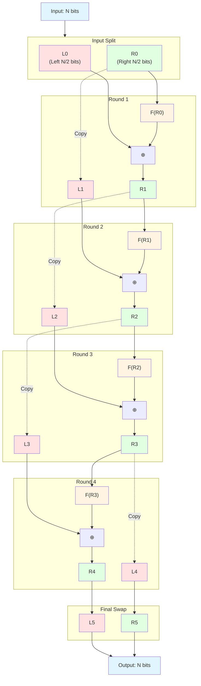
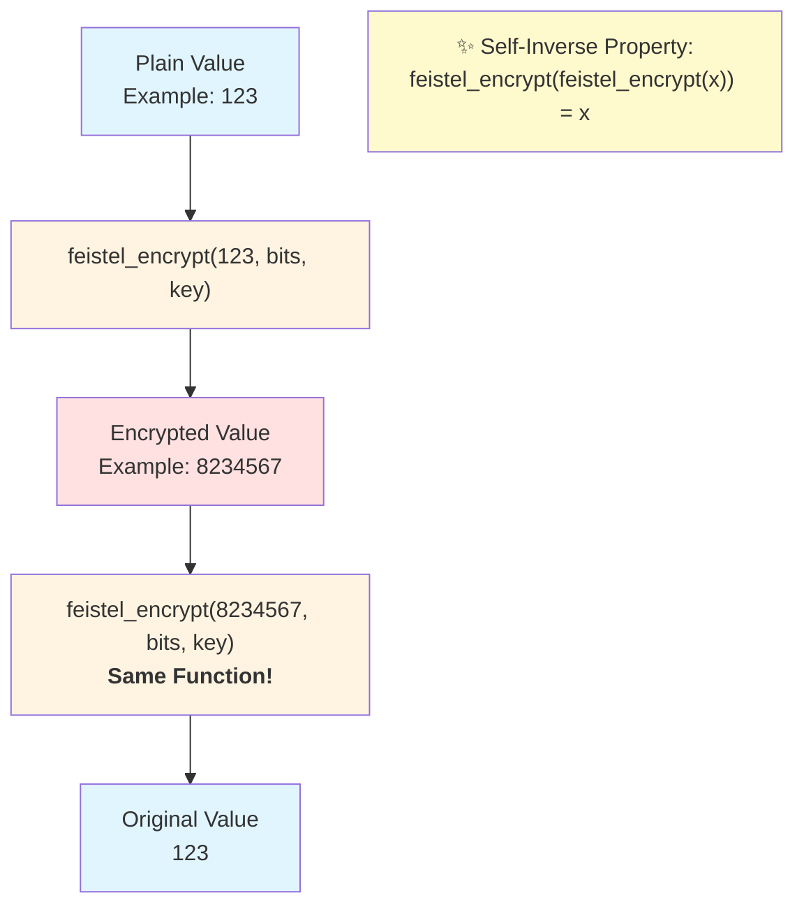

# FeistelCipher

Database functions for Feistel cipher.

This library provides Mix tasks and Ecto migrations to set up and manage Feistel cipher functions and triggers in your PostgreSQL database. Feistel cipher can be used to generate reversible, non-sequential IDs from sequential numbers.

## How It Works

The Feistel cipher is a symmetric structure used in the construction of block ciphers. This library implements a 4-round Feistel network that transforms sequential integers into non-sequential encrypted integers in a reversible manner.



### Algorithm Details

For each round, the Feistel function `F` is defined as:

```
F(x, key, salt) = (((x ⊕ salt) × salt) ⊕ key) & half_mask
```

Where:
- `⊕` is XOR operation
- `×` is multiplication
- `&` is bitwise AND
- `half_mask` ensures the result fits in N/2 bits

### Self-Inverse Property

The Feistel cipher is **self-inverse**: applying the same function twice returns the original value. This means encryption and decryption use the exact same algorithm.



This self-inverse property comes from the Feistel network structure:
- Each round swaps and transforms the left and right halves
- The final swap (Round 4) ensures that applying the function twice reverses all transformations
- **feistel_encrypt(feistel_encrypt(x, bits, key), bits, key) = x**

In the database trigger implementation, this means:
```sql
-- Encryption: seq → id
id = feistel_encrypt(seq, bits, key)

-- Decryption: id → seq (using the same function!)
seq = feistel_encrypt(id, bits, key)
```

### Key Properties

1. **Reversible**: The same function encrypts and decrypts (self-inverse with 4 rounds + final swap)
2. **Deterministic**: Same input always produces same output
3. **Non-sequential**: Sequential inputs produce seemingly random outputs
4. **Collision-free**: Different inputs always produce different outputs within the bit range

## Installation

You can install FeistelCipher using `igniter` or by manually adding it to your dependencies.

### Using igniter (Recommended)

```bash
mix igniter.install feistel_cipher
```

You can customize the installation with the following options:

* `--repo` or `-r`: Specify an Ecto repo for FeistelCipher to use.
* `--functions-prefix` or `-p`: Specify the PostgreSQL schema prefix where the FeistelCipher functions will be created, defaults to `public`.
* `--functions-salt` or `-s`: Specify the constant value used in the Feistel cipher algorithm. Changing this value will result in different cipher outputs for the same input, should be less than 2^31, defaults to `1_076_943_109`.

Example with custom options:

```bash
mix igniter.install feistel_cipher --repo MyApp.Repo --functions-prefix accounts --functions-salt 123456789
```

### Manual Installation

1.  Add `feistel_cipher` to your list of dependencies in `mix.exs`:

    ```elixir
    def deps do
      [
        {:feistel_cipher, "~> 0.7.0"}
      ]
    end
    ```

2.  Fetch the dependencies:

    ```bash
    mix deps.get
    ```

3.  Run the installer to generate the initial migration files:

    ```bash
    mix feistel_cipher.install
    ```
    This command will generate a migration file in your `priv/repo/migrations` directory. You can customize the installation with the following options:

    * `--repo` or `-r`: Specify an Ecto repo for FeistelCipher to use.
    * `--functions-prefix` or `-p`: Specify the PostgreSQL schema prefix where the FeistelCipher functions will be created, defaults to `public`.
    * `--functions-salt` or `-s`: Specify the constant value used in the Feistel cipher algorithm. Changing this value will result in different cipher outputs for the same input, should be less than 2^31, defaults to `1_076_943_109`.


## Example Ecto Schema

Below is an example of an Ecto schema for a table that uses a Feistel cipher.
In this common setup:
- The `seq` column is a `BIGSERIAL` (auto-incrementing integer) in the database, serving as the source for the Feistel cipher.
- The `id` column is a `BIGINT` primary key, and its value is automatically generated by a database trigger using the `seq` column.

```elixir
defmodule MyApp.MyTable do
  use Ecto.Schema

  # Defines `id` as the primary key (typically BIGINT in the DB).
  # `autogenerate: true` indicates that its value is set by a database trigger
  # based on the Feistel cipher of the `seq` column, not by a DB sequence directly on `id`.
  @primary_key {:id, :id, autogenerate: true}
  @foreign_key_type :id # For foreign keys referencing this table's `id`.

  schema "my_table" do
    # `seq` is the source for the Feistel cipher. In the database, this is typically a BIGSERIAL column.
    # Ecto's `:id` type with `autogenerate: true` here reflects the auto-incrementing nature
    # of a BIGSERIAL column when mapped in Ecto for a non-primary key field.
    field :seq, :id, autogenerate: true

    # The `id` field itself (the primary key) is implicitly defined by @primary_key.
    # Its value will be populated by the Feistel cipher trigger.

    timestamps()
  end
end
```

When creating the actual database table via a migration:
- You would define `seq` as `BIGSERIAL`.
- You would define `id` as `BIGINT` and set it as the primary key.
The Ecto schema above reflects how Ecto maps these PostgreSQL types and their behaviors. The `feistel_cipher` trigger will take the auto-generated `seq` value and populate the `id` column with the Feistel-ciphered value.

## Creating Triggers for Tables

To automatically encrypt a source column into a target column for a specific table, you can create a database trigger. The `FeistelCipher.Migration.up_for_encryption/5` function helps generate the necessary SQL.

For example, if you have a table named `posts` with a `seq` column (source) and you want to store the Feistel ciphered ID in an `id` column (target):

```elixir
# Example: priv/repo/migrations/YYYYMMDDHHMMSS_add_posts_feistel_trigger.exs
defmodule MyApp.Repo.Migrations.AddPostsFeistelTrigger do
  use Ecto.Migration

  def up do
    execute FeistelCipher.Migration.up_for_encryption("public", "posts", "seq", "id", bits: 52)
  end

  def down do
    execute FeistelCipher.Migration.down_for_encryption("public", "posts", "seq", "id")
  end
end
```

Then run `mix ecto.migrate` to apply the migration.

The `up_for_encryption/5` function accepts the following arguments:

*   `prefix`: (String, required) The PostgreSQL schema prefix where the table resides.
*   `table`: (String, required) The name of the table.
*   `source`: (String, required) The name of the source column containing the `bigint` integer (typically from a `BIGSERIAL` column like `seq`).
*   `target`: (String, required) The name of the target column to store the encrypted integer (typically the `BIGINT` primary key like `id`).
*   `opts`: (Keyword list, optional) Configuration options:
    *   `:bits` - (Integer, optional) The number of bits for the Feistel cipher. Must be an even number, 62 or less. The default is 52 for LiveView and JavaScript interoperability.
    *   `:key` - (Integer, optional) The encryption key. Must be between 0 and 2^31-1. If not provided, a key is automatically generated.
    *   `:functions_prefix` - (String, optional) The PostgreSQL schema prefix where the FeistelCipher functions are located. Defaults to "public".

**⚠️ Important:** Once a table has been created with a specific `bits` value, you **cannot** change the `bits` setting later. The Feistel cipher algorithm depends on the `bits` parameter, and changing it would make existing encrypted IDs incompatible with the new cipher. If you need to change the `bits` value, you would need to:
1. Drop the existing trigger using `down_for_encryption/4`
2. Recreate all existing data with the new cipher
3. Set up the new trigger with the desired `bits` value

For this reason, carefully consider your `bits` requirement before creating the initial trigger.

The trigger will automatically populate the `target` column when a new row is inserted. It also prevents manual modification of the `target` column on update.

## License

MIT