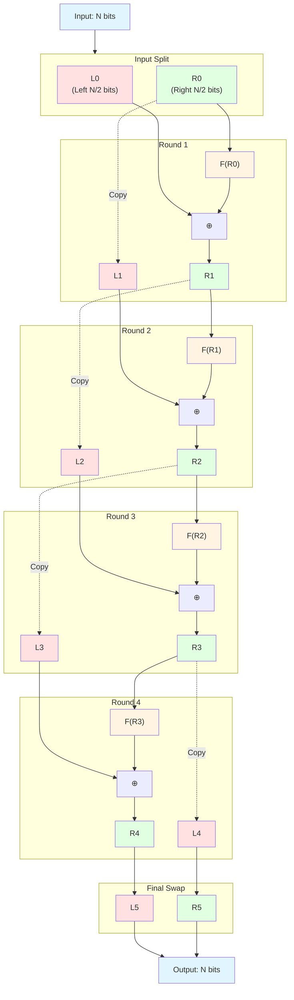

# FeistelCipher

Generate non-sequential, unpredictable IDs while maintaining the performance benefits of sequential primary keys.

## Why?

**Problem**: Sequential IDs (1, 2, 3...) leak business information:
- Competitors can estimate your growth rate
- Users can enumerate resources (`/posts/1`, `/posts/2`...)
- Total record counts are exposed

**Common Solutions & Issues**:
- UUIDs: Poor database performance (index fragmentation, 16 bytes storage)
- Random integers: Collision risks, complex generation logic

**This Library's Approach**:
- Store sequential `seq` (fast, efficient indexing)
- Expose encrypted `id` (non-sequential, reversible)
- Transform via database trigger (zero application overhead)

## How It Works

The Feistel cipher is a symmetric structure used in the construction of block ciphers. This library implements a 4-round Feistel network that transforms sequential integers into non-sequential encrypted integers in a reversible manner.



### Algorithm Details

For each round, the Feistel function `F` is defined as:

```
F(x, key, salt) = (((x ⊕ salt) × salt) ⊕ key) & half_mask
```

Where:
- `⊕` is XOR operation
- `×` is multiplication
- `&` is bitwise AND
- `half_mask` ensures the result fits in N/2 bits

### Self-Inverse Property

The Feistel cipher is **self-inverse**: applying the same function twice returns the original value. This means encryption and decryption use the exact same algorithm.

**Mathematical Proof:**

Let's denote the input as $(L_0, R_0)$ and the round function as $F(x)$.

**First application (Encryption):**

```math
\begin{aligned}
L_1 &= R_0, & R_1 &= L_0 \oplus F(R_0) \\
L_2 &= R_1, & R_2 &= L_1 \oplus F(R_1) \\
L_3 &= R_2, & R_3 &= L_2 \oplus F(R_2) \\
L_4 &= R_3, & R_4 &= L_3 \oplus F(R_3) \\
\text{Output} &= (R_4, L_4)
\end{aligned}
```

**Second application (Decryption) - Starting with $(R_4, L_4)$:**

```math
\begin{aligned}
L_1' &= L_4, & R_1' &= R_4 \oplus F(L_4) \\
&= L_4, & &= R_4 \oplus F(R_3) \\
&= L_4, & &= (L_3 \oplus F(R_3)) \oplus F(R_3) \\
&= L_4, & &= L_3 \quad \text{(XOR cancellation)} \\
\\
L_2' &= R_1' = L_3, & R_2' &= L_1' \oplus F(R_1') \\
&= L_3, & &= L_4 \oplus F(L_3) \\
&= L_3, & &= R_3 \oplus F(R_2) \\
&= L_3, & &= (L_2 \oplus F(R_2)) \oplus F(R_2) \\
&= L_3, & &= L_2 \quad \text{(XOR cancellation)} \\
\\
L_3' &= R_2' = L_2, & R_3' &= L_2' \oplus F(R_2') \\
&= L_2, & &= L_3 \oplus F(L_2) \\
&= L_2, & &= R_2 \oplus F(R_1) \\
&= L_2, & &= (L_1 \oplus F(R_1)) \oplus F(R_1) \\
&= L_2, & &= L_1 = R_0 \\
\\
L_4' &= R_3' = R_0, & R_4' &= L_3' \oplus F(R_3') \\
&= R_0, & &= L_2 \oplus F(R_0) \\
&= R_0, & &= R_1 \oplus F(R_0) \\
&= R_0, & &= (L_0 \oplus F(R_0)) \oplus F(R_0) \\
&= R_0, & &= L_0 \quad \text{(XOR cancellation)} \\
\\
\text{Output} &= (R_4', L_4') = (L_0, R_0) \quad \checkmark
\end{aligned}
```

**Key Insight:** The XOR operation's property $a \oplus b \oplus b = a$ ensures that each transformation is reversed when applied twice.

**Database Implementation:**

In the database trigger implementation, this means:
```sql
-- Encryption: seq → id
id = feistel_encrypt(seq, bits, key)

-- Decryption: id → seq (using the same function!)
seq = feistel_encrypt(id, bits, key)
```

### Key Properties

- **Deterministic**: Same input always produces same output
- **Non-sequential**: Sequential inputs produce seemingly random outputs
- **Collision-free**: One-to-one mapping within the bit range

## Installation

### Using igniter (Recommended)

```bash
mix igniter.install feistel_cipher
```

### Manual Installation

```elixir
# mix.exs
def deps do
  [{:feistel_cipher, "~> 0.7.2"}]
end
```

Then run:
```bash
mix deps.get
mix feistel_cipher.install
```

### Installation Options

Both methods support the following options:

* `--repo` or `-r`: Specify an Ecto repo (required for manual installation)
* `--functions-prefix` or `-p`: PostgreSQL schema prefix (default: `public`)
* `--functions-salt` or `-s`: Cipher salt constant, max 2^31-1 (default: `1_076_943_109`)


## Usage Example

### 1. Create Migration

```elixir
defmodule MyApp.Repo.Migrations.CreatePosts do
  use Ecto.Migration

  def up do
    create table(:posts, primary_key: false) do
      add :seq, :bigserial
      add :id, :bigint, primary_key: true
      add :title, :string
      
      timestamps()
    end

    execute FeistelCipher.up_for_trigger("public", "posts", "seq", "id")
  end

  def down do
    execute FeistelCipher.down_for_trigger("public", "posts", "seq", "id")
    drop table(:posts)
  end
end
```

### 2. Define Schema

```elixir
defmodule MyApp.Post do
  use Ecto.Schema

  @primary_key {:id, :id, autogenerate: true}
  schema "posts" do
    field :seq, :id, autogenerate: true
    field :title, :string
    
    timestamps()
  end
  
  # Use @derive to control JSON serialization
  @derive {Jason.Encoder, except: [:seq]}  # Hide seq in API responses
end
```

Now when you insert a record, `seq` auto-increments and the trigger automatically sets `id = feistel_encrypt(seq)`:

```elixir
%Post{title: "Hello"} |> Repo.insert()
# => %Post{id: 8234567, seq: 1, title: "Hello"}

# In API responses, only id is exposed (seq is hidden)
```

**Security Note**: Keep `seq` internal. Only expose `id` in APIs to prevent enumeration attacks.

## Trigger Options

The `up_for_trigger/5` function accepts these options:

- `prefix`, `table`, `source`, `target`: Table and column names (required)
- `bits`: Cipher bit size (default: 52, max: 62, must be even) - **Cannot be changed after creation**
  - Default 52 ensures JavaScript compatibility (`Number.MAX_SAFE_INTEGER = 2^53 - 1`)
  - Use 62 for maximum range if no browser/JS interaction needed
- `key`: Encryption key (auto-generated if not specified)
- `functions_prefix`: Schema where cipher functions reside (default: `public`)

Example with custom options:
```elixir
execute FeistelCipher.up_for_trigger(
  "public", "posts", "seq", "id", 
  bits: 40, 
  key: 123456789,
  functions_prefix: "crypto"
)
```

## License

MIT